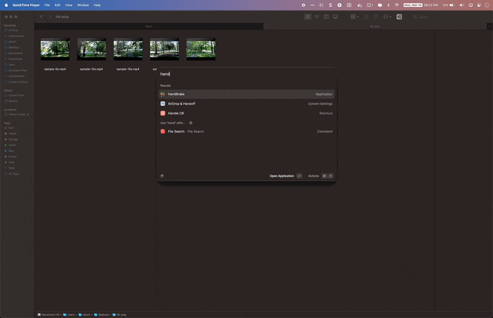
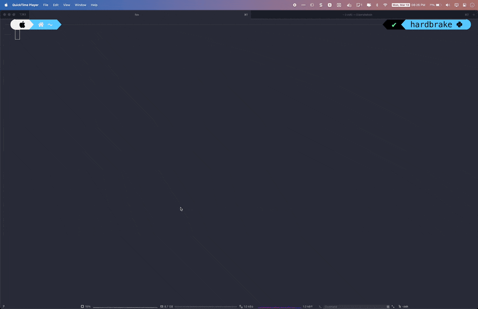

# HardBrake

HardBrake is a wrapper around [HandBrake CLI](https://github.com/HandBrake/HandBrake) for encoding multiple files with ease. HardBrake lets you encode multiple files at once and shows the progress for each file. With HardBrake, you don't have to encode each file individually, saving you time and effort. While it is not concurrent at this moment, HardBrake is still a useful tool for encoding your files. Give HardBrake a try and see how it can make your file encoding workflow more efficient.

## Demo 🎬

With Handbrake

With HardBrake

## Installation

Will Add

## Usage

Will Add

## License

HardBrake is licensed under the MIT License. See the LICENSE file for more information.
